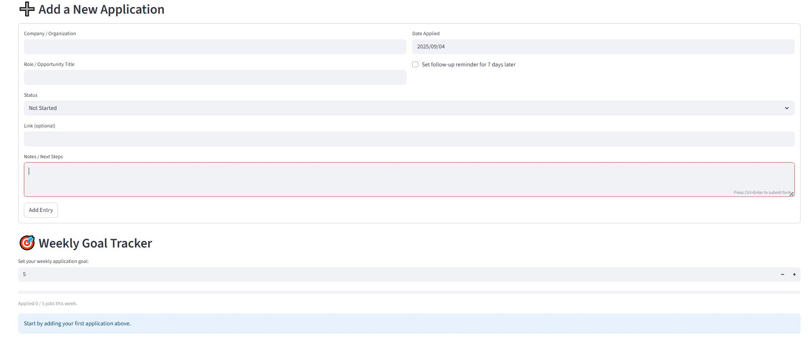
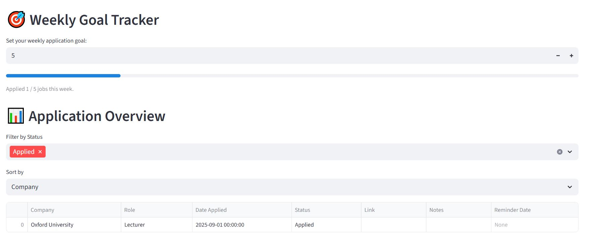

# Application Tracker 2.0

A Streamlit app to track job applications with simple dashboards.

## Features
- Log applications with company, role, date, and status  
- Filter by status and sort applications  
- View progress charts (bar and pie)  
- Export data to CSV  

## How to run it
pip install streamlit  

streamlit run application_tracker.py

## Screenshots
### Top of Dashboard

### Bottom of Dashboard

